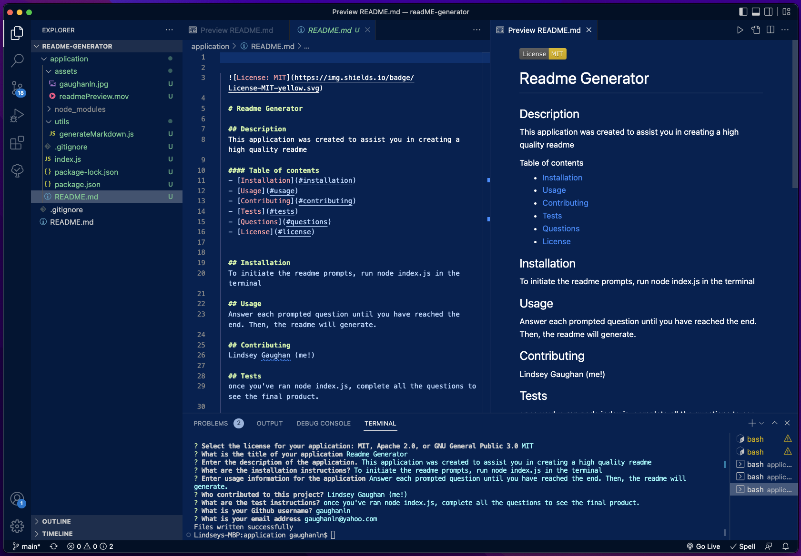

# README Generator

## Description

I've created a README generator that works with the integrated terminal using node.js

## Criteria:

* A command-line application that prompts the user with an array of questions and accepts the user input 
* A high quality README.md file is created and includes:
  - Title
  - Description
  - Table of Contents
  - Installation
  - Usage
  - License 
  - Contributing
  - Tests
  - Questions

* The table of contents should link to sections throughout the README
* The License will return a badge, link, and description about the license
* The questions area will contain an email address as well as the Github username and a link to the github profile

<!-- Video of application in progress -->
## End Product 
Below is a video of the application in use <video src='./application/assets/readmePreview.mov' width=425px>

<!-- screenshots -->
Below is a screenshot of the generated readme

<!-- link -->
## Deployment
Here is the [link](https://github.com/gaughanln/readME-generator) to the Github repo

## Contributing
Lindsey Gaughan (Me!) 

{:height="200px"}

https://user-images.githubusercontent.com/111533986/216470576-059ed02f-19d3-4476-a380-b3a05b139b38.mov

